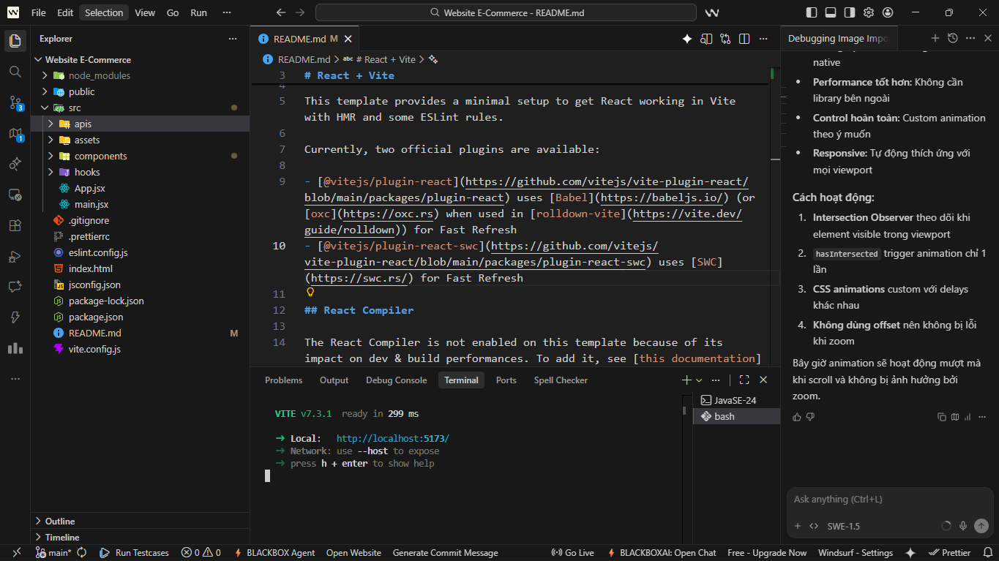
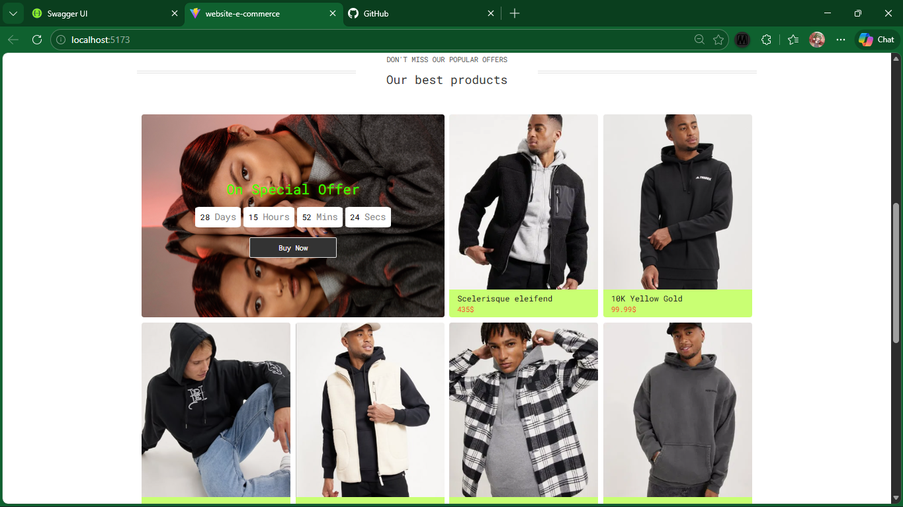
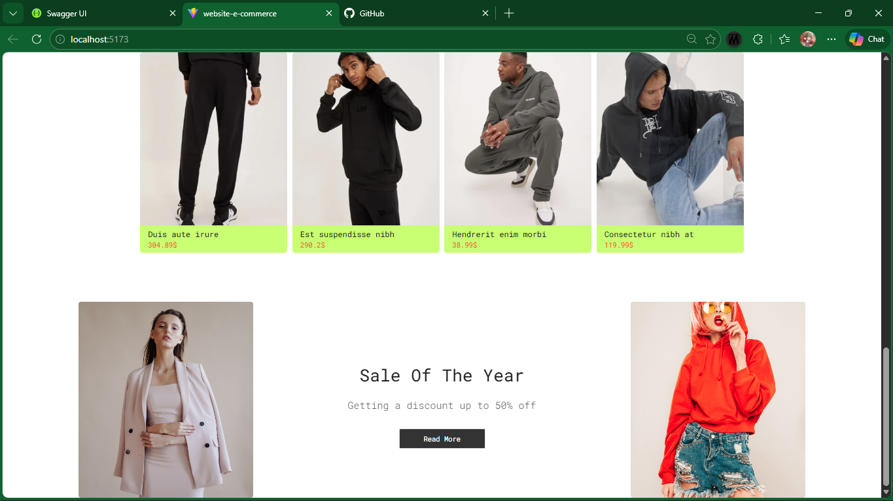
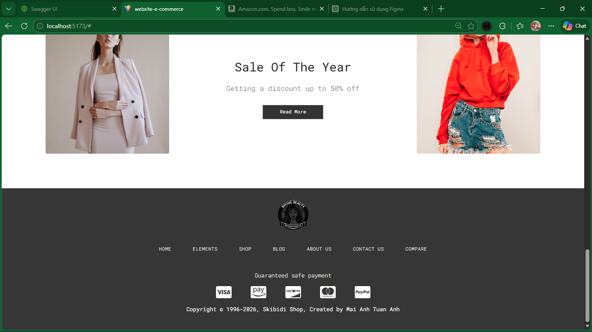
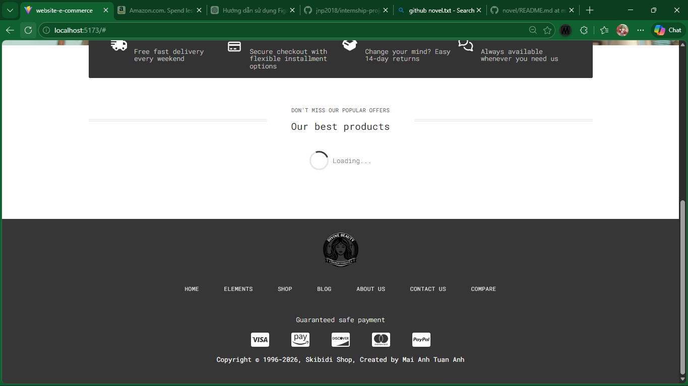

[Link BackEnd => Turn it on to use](https://be-project-reactjs.onrender.com/api-docs/#/Products/get_product)

# Thực tập Cơ sở – Kế hoạch & Tiến độ 08 Tuần

## 1. Thông tin sinh viên

- Họ tên: Mai Anh Tuấn Anh

- MSV: B23DCCE005

- Lớp: D23CQCE05-B

- Email: sktt10mtd@gmail.com

- GitHub username: mai-anh-tuan-anh

## 2. Đăng ký chủ đề thực tập

- Định hướng (roadmap.sh): Frontend Developer

☒ Cải thiện / tập trung vào một kỹ năng

☒ Kỹ năng mới / trend

☐ Nghiên cứu / đề tài / dự án

- Kỹ năng chính (theo thứ tự)

* React

* REST API + Fetch / Axios

* UI/UX cơ bản cho web bán hàng

- Đề tài thực tập

### Website bán hàng React hoàn chỉnh gồm:

- Danh sách sản phẩm

- Trang chi tiết sản phẩm

- Giỏ hàng

- Routing

- Responsive UI

- Deploy hoàn chỉnh

## Nội dung thực hiện

- Áp dụng React để xây dựng giao diện theo mô hình SPA

- Sử dụng REST API kết hợp Fetch/Axios để lấy và xử lý dữ liệu

- Thiết kế UI/UX cho website thương mại điện tử

- Triển khai các chức năng: hiển thị sản phẩm, xem chi tiết, giỏ hàng, điều hướng trang

=> Sản phẩm cuối cùng là một website bán hàng có thể chạy và demo trên môi trường thực tế.

GitHub Repository

🔗 https://github.com/mai-anh-tuan-anh/Website-E-Commerce.git

## 3. Kế hoạch thực hiện 08 tuần

#### Tuần 1 – Khởi động

- Nhiệm vụ

Khởi tạo project React (Vite hoặc CRA)

Làm quen JSX & Component

Xây dựng cấu trúc thư mục

- Kết quả đầu ra

Project React chạy được trên local

Repo GitHub có cấu trúc src rõ ràng

#### Tuần 2 – Triển khai cơ bản (Buổi trao đổi 1)

- Nhiệm vụ

Học useState

Tạo component: Header, Footer, ProductList

Sử dụng props truyền dữ liệu

Hiển thị danh sách sản phẩm bằng dữ liệu tĩnh (JSON)

- Kết quả đầu ra

Giao diện trang chủ gồm Header, Footer, ProductList

UI đúng bố cục, không vỡ layout

#### Tuần 3 – Mở rộng

- Nhiệm vụ

Học useEffect

Dùng REST API giả (hoặc JSON Server)

Xử lý loading & error

- Kết quả đầu ra

Load dữ liệu sản phẩm từ API

Hiển thị loading khi gọi API

Hiển thị thông báo lỗi khi API thất bại

#### Tuần 4 – Hoàn thiện giữa kỳ (Buổi trao đổi 2)

- Nhiệm vụ

Học React Router

Tạo các trang: Home, Product Detail, Cart

- Kết quả đầu ra

Router hoạt động đúng

URL thay đổi theo trang

Click từ danh sách → trang chi tiết sản phẩm

Trang chi tiết hiển thị đúng theo ID trên URL

#### Tuần 5 – Nâng cao / Tối ưu

- Nhiệm vụ

Xây dựng chức năng giỏ hàng

Quản lý cart bằng Context hoặc state nâng cao

Responsive UI (mobile friendly)

- Kết quả đầu ra

Cart hoạt động (thêm, xóa sản phẩm)

Website hiển thị tốt trên mobile

#### Tuần 6 – Kiểm thử / Đánh giá (Buổi trao đổi 3)

- Nhiệm vụ

Tối ưu UI/UX (hiển thị số lượng, tổng tiền)

Validate form cơ bản

(Nếu có backend) Kết nối API thật

- Kết quả đầu ra

Website chạy mượt

Code được refactor gọn gàng

Component tách hợp lý, giảm trùng lặp

#### Tuần 7 – Hoàn thiện cuối

- Nhiệm vụ

Tính năng Search sản phẩm

Filter theo danh mục & giá

QR Scan thanh toán

Test tương tác giữa các trang

- Kết quả đầu ra

Search hoạt động theo từ khóa

Filter hoạt động chính xác (có thể kết hợp nhiều điều kiện)

QR Scan chuyển đúng ngân hàng thanh toán

#### Tuần 8 – Tổng kết (Buổi trao đổi 4)

- Nhiệm vụ

Báo cáo kết quả

Demo đầy đủ chức năng

- Kết quả đầu ra

Website bán hàng hoàn chỉnh

Có thể demo trực tiếp

4. Checklist & Tổng kết

Tham gia đủ 04 buổi trao đổi

Cập nhật tiến độ định kỳ

Kết quả cuối chạy được / demo được

Tự đánh giá mức độ hoàn thành

…… %

Vướng mắc / nội dung cần giảng viên hỗ trợ

(Ghi nội dung tại đây)

Link repository cuối cùng (nếu có)

(Thêm link tại đây)
